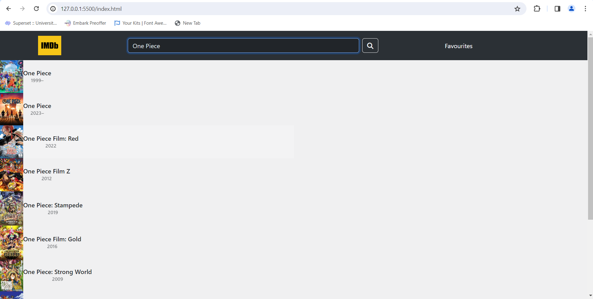
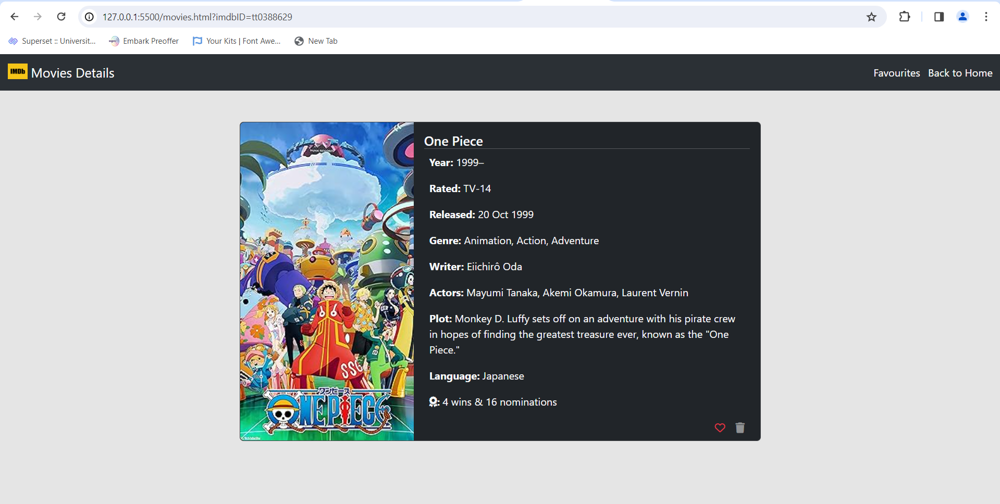
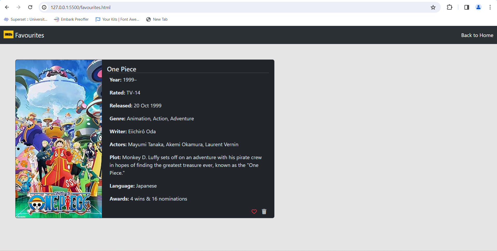

# ImdbClone-App

This is a simple IMDb clone project built using HTML, CSS, Bootstrap, and Vanilla JavaScript. The app utilizes the OMDB API to search for movies and display information about them. Users can also mark movies as their favorites and view them later.

## Features

- **Search Functionality**: Users can search for movies using the OMDB API. As they type, the search results update dynamically, similar to Google's suggestions.

- **Movie Page**: Clicking on any search result opens a new page displaying more detailed information about the selected movie, including its name, photo, plot, etc.

- **Favorite Movies Page**: Users can view a list of all their favorite movies. This list is persistent, meaning it remains the same even after closing or refreshing the browser.

- **Remove from Favorites**: Each movie in the favorites list has a "🗑️" button. Clicking on this button removes the movie from the list.

# Technologies Used
### Frontend:

* HTML 
* CSS
* JavaScript
* BootStrap

## How to Use

* Clone this repository to your local machine.
* Open `index.html` in your web browser.
* Use the search bar to search for movies. As you type, the search results will update.
* Click on any search result to view more information about that movie.
* To mark a movie as a favorite, click on the "❤️" button on the movie page. You will receive an alert confirming that the movie has been added to favorites.
* To view your favorite movies, click on the "favourites" on the navbar.
* To remove a movie from your favorites, click on the "🗑️" button on the favorites page. You will receive an alert confirming that the movie has been removed from favorites.

## Screenshots

## Dependencies

This project relies on standard web technologies without additional libraries or frameworks. The core dependencies include:

- **HTML**: The project uses HTML to define the structure and content of the web page.
- **CSS**: Styling is achieved using CSS to enhance the visual presentation of the user interface.
- **JavaScript**:Vanilla JavaScript is used for implementing for Implementing the Logic.
- **Bootstrap**: For styling the UI.
- No external libraries or frameworks are utilized, ensuring a lightweight and self-contained implementation.

## License

This project is licensed under the MIT License - see the [LICENSE](LICENSE) file for details.
